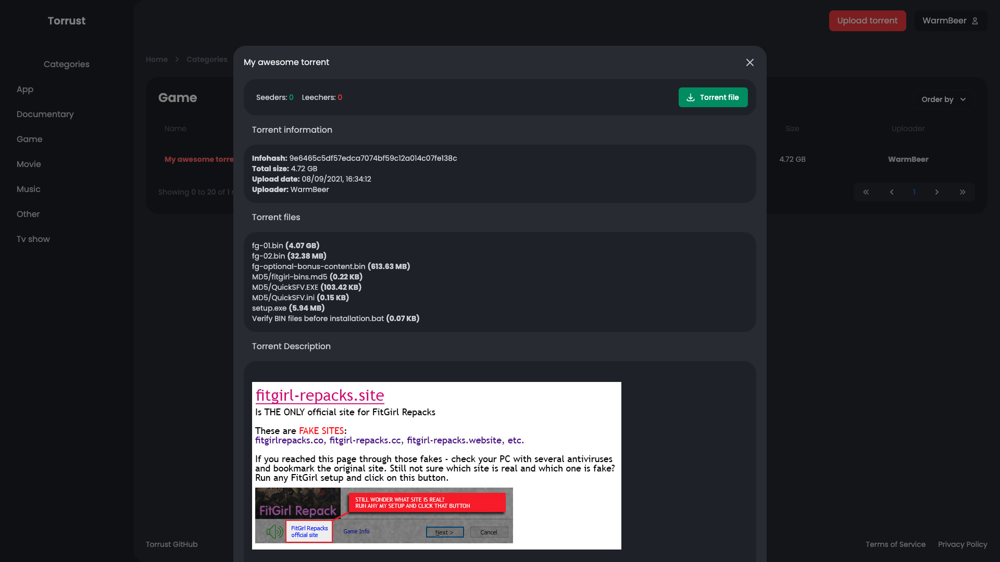

# Torrust Documentation

## Introduction
Torrust is an open source project that brings you all the tools you need to host your own (private) online torrent database.

### Project structure
Torrust is split up into three separate applications.

- [__Torrust Backend__](https://github.com/torrust/torrust-web-backend): A REST API written in Rust with the Actix web framework that acts as a backend for the Torrust Frontend.
- [__Torrust Frontend__](https://github.com/torrust/torrust-web-frontend): A Vue application where torrents can be uploaded and downloaded.
- [__Torrust Tracker__](https://github.com/torrust/torrust-tracker): A UDP based torrent tracker built with Rust.

### Features
- [X] Email / Password authentication
- [X] Self-hosted Private Tracker
- [X] Torrent Uploading / Downloading
- [X] No external services needed
- [X] Completely written in Rust

### Screenshots



# Installation

## Torrust web + tracker
Please follow our [guide](https://torrust.github.io/torrust-documentation/installation/).

## Torrust Documentation site
### Prerequisites (installed)

- [Python](https://www.python.org/)
- [pip](https://pip.pypa.io/en/stable/installing/)
- [MkDocs](https://www.mkdocs.org/#installation)
- [MkDocs Material theme](https://squidfunk.github.io/mkdocs-material/getting-started/)

### Project Files

Clone repo:

```bash
git clone https://github.com/torrust/docs.git
```

# Usage

### Run Development

Navigate to the project folder (docs) and run the following command:

```bash
mkdocs serve
```

### Test Development

Visit `http://localhost:8000` to see live changes.

### Run Production

Navigate to the project folder (docs) and build the static site:

```bash
mkdocs build
```

Publish the newly built docs/site folder using NGINX or Apache.

## Contributing
Please report any bugs you find to our issue tracker. Ideas and feature requests are welcome as well!
Any pull request targeting existing issues would be very much appreciated.
