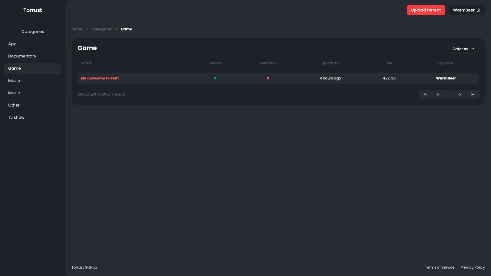

# About

## Introduction
Torrust is an open source BitTorrent tracker developed using the Rust language. 
With Torrust, you can upload torrents and supply additional information (such as a description and images) for other users to view and download.

## Project structure
Torrust is split up into three separate applications.

- [__Torrust Backend__](https://github.com/torrust/torrust-web-backend): A REST API written in Rust with the Actix web framework that acts as a backend for the Torrust Frontend.
- [__Torrust Frontend__](https://github.com/torrust/torrust-web-frontend): A Vue application where torrents can be uploaded and downloaded.
- [__Torrust Tracker__](https://github.com/torrust/torrust-tracker): A UDP based torrent tracker built with Rust.

## Features
- [X] Email / Password authentication
- [X] E-mail verification
- [X] Torrent Uploading / Downloading
- [X] No external services needed
- [X] Completely written in Rust

## Screenshots
{ align=center }

## Contributing
Please report any bugs you find to our issue tracker. Ideas and feature requests are welcome as well!
Any pull request targeting existing issues would be very much appreciated.